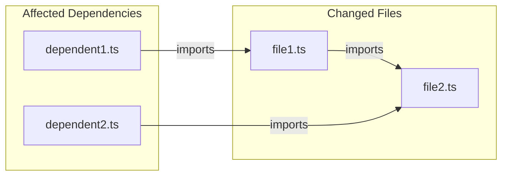
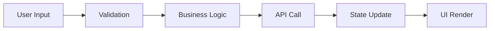
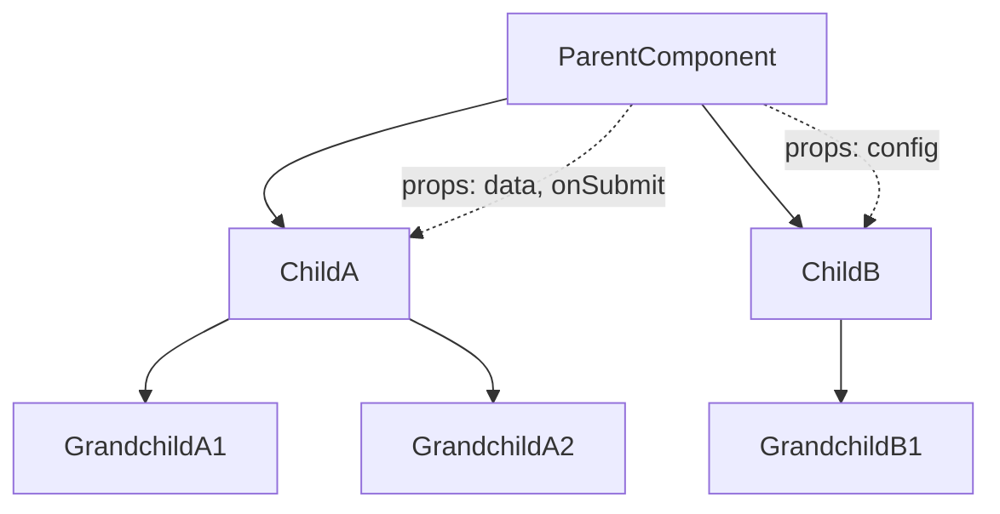
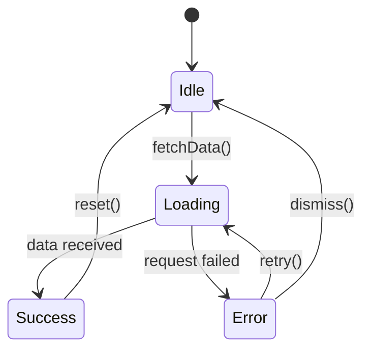
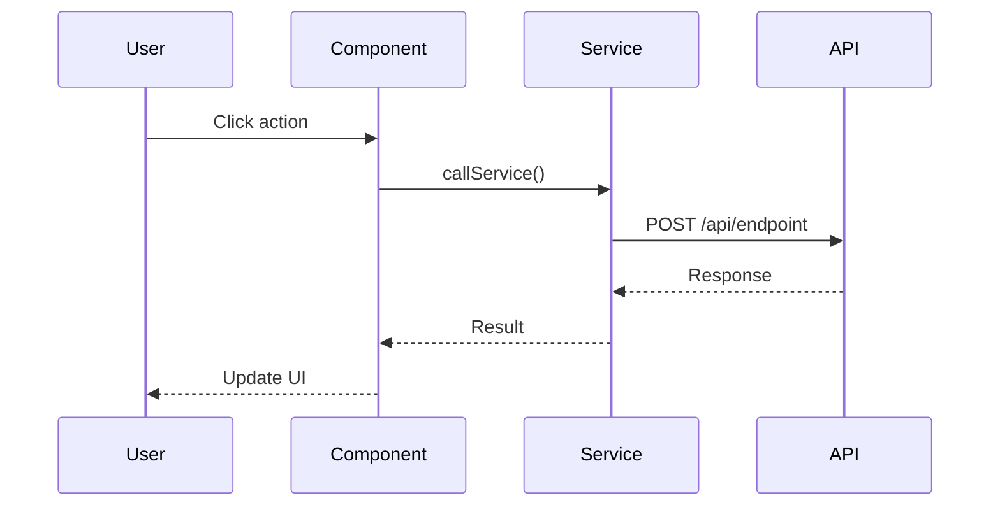
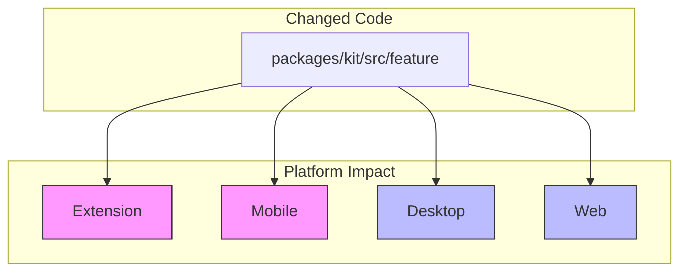

# Secure PR Review

Follow this workflow when reviewing code changes. Prioritize **security > correctness > architecture > performance**.

## Review scope (base branch)
- Review scope: treat `x` as the base (main) branch. Always review the PR as the diff between the current branch (HEAD) and `x` (i.e., changes introduced by this branch vs `x`).
- Use PR semantics when generating the diff: `git fetch origin && git diff origin/x...HEAD` (triple-dot) to review only the changes introduced on this branch relative to `x`.

## 0) Scope the change & File Structure Analysis

- Identify what changed (files, modules, entrypoints, routes/screens).
- Identify risk areas: auth flows, signing/keys, networking, analytics, storage, dependency updates.

### 0.1 File Change Inventory (REQUIRED)

Generate a structured overview of ALL changed files using this format:

```markdown
## PR File Structure Analysis

### Changed Files Summary
| File | Change Type | Category | Risk Level | Description |
|------|-------------|----------|------------|-------------|
| `path/to/file.ts` | Added/Modified/Deleted | UI/Logic/API/Config/Test | Low/Medium/High | Brief description |

### Files by Category

#### 🔐 Security-Critical Files
- Files touching auth, crypto, keys, secrets

#### 🌐 API/Network Files
- Files with network requests, API calls

#### 🧩 Business Logic Files
- Core logic, state management, services

#### 🎨 UI Component Files
- React components, styles, layouts

#### ⚙️ Configuration Files
- package.json, configs, manifests

#### 🧪 Test Files
- Unit tests, integration tests

#### 📦 Dependency Changes
- package.json, lockfile changes
```

### 0.2 Per-File Analysis (REQUIRED)
For EACH changed file, provide:

```markdown
### `path/to/file.ts`
**Change Type**: Added | Modified | Deleted
**Lines Changed**: +XX / -YY
**Category**: UI | Logic | API | Config | Test
**Risk Level**: Low | Medium | High | Critical

**What This File Does**:
- Primary responsibility of this file

**Changes Made**:
1. Specific change 1
2. Specific change 2
3. ...

**Dependencies**:
- Imports from: [list key imports]
- Exported to: [list files that import this]

**Security Considerations**:
- Any security-relevant aspects

**Cross-Platform Impact**:
- [ ] Extension
- [ ] Mobile (iOS/Android)
- [ ] Desktop
- [ ] Web
```

## 1) Secrets / PII / privacy (MUST)
- Do not allow logs/telemetry/error reports to include: mnemonics/seed phrases, private keys, signing payloads, API keys, tokens, cookies, session IDs, addresses tied to identity, or any PII.
- Inspect all “exfil paths”: `console.*`, logging utilities, analytics SDKs, error reporting, network requests, and persistence:
  - Web: localStorage / IndexedDB
  - RN: AsyncStorage / secure storage
  - Desktop: filesystem / keychain / sqlite
- If any potential leak exists, explicitly document:
  - **source** (what sensitive data),
  - **sink** (where it goes),
  - **trigger** (when it happens),
  - **impact** (who/what is exposed),
  - **fix** (concrete remediation).

## 2) AuthN / AuthZ (MUST)
- Verify authentication middleware/guards wrap every protected route and cannot be bypassed.
- Verify authorization checks (roles/permissions) are correct and consistent.
- Verify server/client trust boundaries: never trust client input for authorization decisions.

## 3) Dependency & supply-chain security (HIGHEST PRIORITY)
If `package.json` / lockfiles changed, you MUST do all of the following:

### 3.1 Enumerate changes
- List every added/updated/removed dependency with **name + from→to version** and the reason (if stated in PR).

### 3.2 Quick ecosystem risk check (before approve)
- For each changed package:
  - check for recent maintainer/ownership changes, suspicious release cadence, known advisories/CVEs, typosquatting risk.
  - if your environment supports it, run commands like: `npm view <pkg> time maintainers repository dist.tarball`.

### 3.3 Source inspection (node_modules) — REQUIRED when risk is non-trivial
- Inspect the dependency’s `node_modules/<pkg>/package.json` and entrypoints (`main` / `module` / `exports`).
- Grep for high-risk behavior (examples; expand as needed):
  - outbound/network: `fetch(`, `axios`, `XMLHttpRequest`, `http`, `https`, `ws`, `request`, `net`, `dns`
  - dynamic execution: `eval`, `new Function`, dynamic `require`, remote script loading
  - install hooks: `postinstall`, `preinstall`, `install`, binary downloads
  - privilege access: filesystem, clipboard, keychain/keystore, environment variables
- Treat as **HIGH RISK** and block approval unless justified + isolated:
  - any telemetry / remote config fetch / unexpected outbound requests
  - any dynamic execution or install-time script behavior
  - any access to sensitive storage or wallet-related data

### 3.4 React Native native-layer inspection (REQUIRED for RN libraries)
- For React Native dependencies (or any package with native bindings: `.podspec`, `ios/`, `android/`, `react-native.config.js`, TurboModules/Fabric):
  - Inspect iOS/Android native sources for security + performance.
  - Confirm there are **no unexpected outbound requests**, no telemetry/upload without explicit product intent, and no access to wallet secrets/private keys/seed data.
  - If necessary, drill into third-party native dependencies:
    - iOS: CocoaPods / `Pods/` sources, vendored frameworks, build scripts
    - Android: Gradle/Maven artifacts, JNI/native libs, build-time tasks
  - Treat any hidden network behavior, dynamic loading, install/build scripts, or obfuscated native code as **HIGH RISK** unless explicitly justified and isolated.

## 4) Mandatory callout when node_modules performs outbound requests
If `node_modules` code performs **any** outbound network/API request (directly or indirectly), call it out clearly in the review:
- **exact call site** (file path + function)
- **destination** (full URL/host)
- **payload fields** (what data is sent)
- **headers/auth** (tokens/cookies/identifiers)
- **trigger conditions** (when/how it runs)
- **cross-platform impact** (extension/mobile/desktop/web)

## 4.1 Extension manifest permissions changes (HIGHEST PRIORITY)
- If `manifest.json` (`permissions`, `host_permissions`, `optional_permissions`) changes:
  - Call it out **prominently** as the top review item.
  - Enumerate added/removed permissions and explain what new capabilities they enable.
  - Assess least-privilege: confirm the permission is strictly necessary, scoped to minimal hosts, and does not broaden data access/exfil paths.
  - Re-check data exposure surfaces introduced by the permission change (network, storage, messaging, content scripts, background/service worker).

## 5) Cross-platform architecture review (extension/mobile/desktop/web)
Review the implementation as a senior multi-platform architect:
- Is the approach the simplest correct solution with good maintainability/testability?
- Identify platform pitfalls:
  - Extension constraints (MV3/service worker lifetimes, permissions, CSP)
  - RN constraints (WebView, native modules, backgrounding)
  - Desktop (Electron security boundaries, IPC, nodeIntegration)
  - Web (CORS, storage, XSS, bundle size, runtime differences)
- If not optimal, propose a better alternative with tradeoffs.

## 6) React performance (hooks + re-render hotspots)
For new/modified components:
- Check for unnecessary re-renders from unstable references:
  - inline objects/functions passed to children
  - incorrect hook dependency arrays
  - state placed too high causing wide re-render fanout
- Validate memoization strategy (`memo`, `useMemo`, `useCallback`) is correct (no stale closures / broken deps).
- Watch for expensive work in render, list rendering issues, and missing cleanup for subscriptions/listeners.
- Apply stricter scrutiny to **new parent/child boundaries** and call out any likely re-render hotspots.

## 7) Review output format (keep it actionable)
- Focus on security/correctness/architecture/performance.
- Avoid UI style / comment nitpicks unless they cause real bugs, security risk, or measurable perf regression.
- Provide findings as:
  - **Blockers** (must fix)
  - **High risk** (strongly recommended)
  - **Suggestions** (nice-to-have)
  - **Questions** (needs clarification)

## Additional resources

- Dependency audit: [reference/dependency-audit.md](reference/dependency-audit.md)
- React performance: [reference/react-performance.md](reference/react-performance.md)
- Cross-platform checks: [reference/cross-platform.md](reference/cross-platform.md)
- File analysis patterns: [reference/file-analysis.md](reference/file-analysis.md)
- Diagram generation: [reference/diagram-generation.md](reference/diagram-generation.md)

## 8) Architecture Visualization (REQUIRED)

Generate visual diagrams to illustrate the PR's architectural impact. Use the `mcp__figma-remote-mcp__generate_diagram` tool to create Mermaid diagrams.

### 8.1 File Dependency Graph

Create a flowchart showing how changed files relate to each other:



### 8.2 Data Flow Diagram

For PRs involving data processing, show the data flow:



### 8.3 Component Hierarchy (for UI changes)

Show component relationships and prop flow:



### 8.4 State Management Flow

For state-related changes, illustrate the state flow:



### 8.5 Sequence Diagram (for async operations)

For complex async flows or API interactions:



### 8.6 Cross-Platform Impact Diagram

Show which platforms are affected:



### Diagram Generation Guidelines

1. **Always generate at least 2 diagrams** for non-trivial PRs:
   - File dependency graph (always)
   - One domain-specific diagram (data flow / component hierarchy / state / sequence)

2. **Use appropriate diagram types**:
   - `graph LR/TD` for file dependencies and component hierarchies
   - `sequenceDiagram` for API calls and async operations
   - `stateDiagram-v2` for state machine changes
   - `flowchart` for data flow and process flow

3. **Highlight risk areas** in diagrams:
   - Use color styling for high-risk nodes
   - Mark security-critical paths clearly
   - Indicate cross-platform boundaries

4. **Keep diagrams focused**:
   - Max 15-20 nodes per diagram
   - Split complex flows into multiple diagrams
   - Group related files into subgraphs
