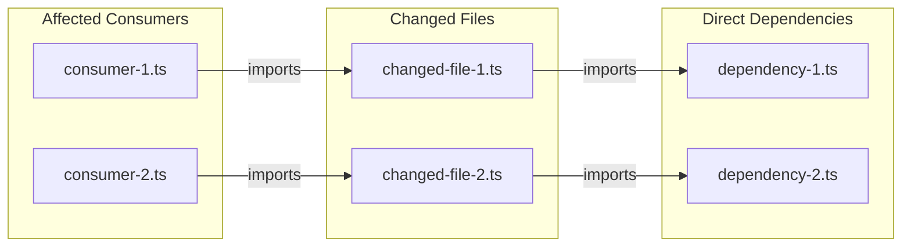
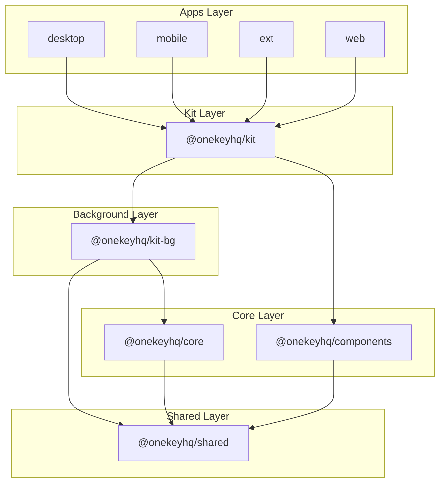
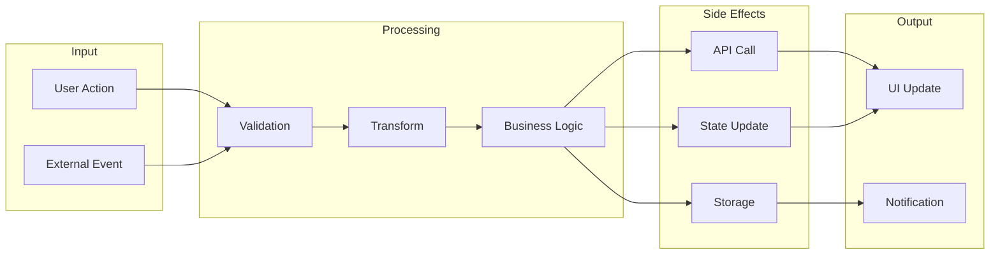
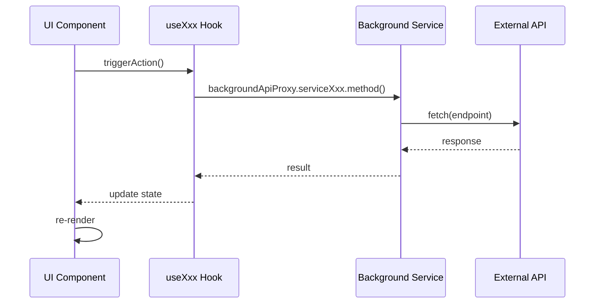
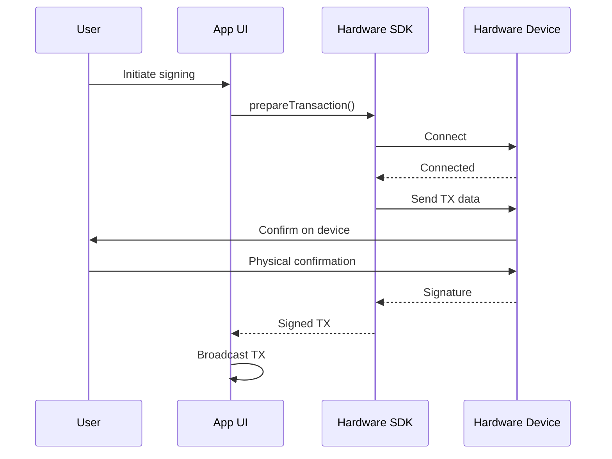
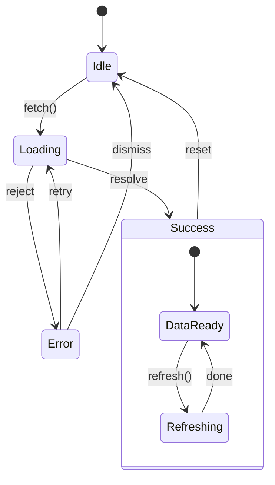
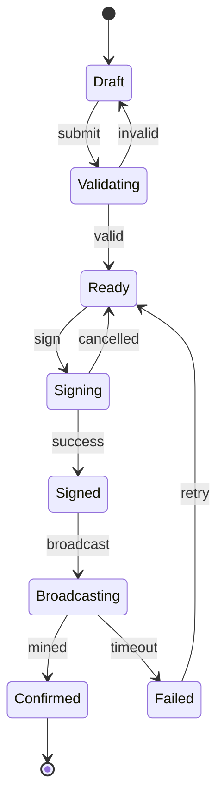
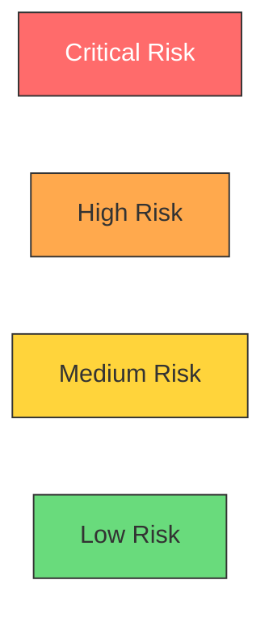
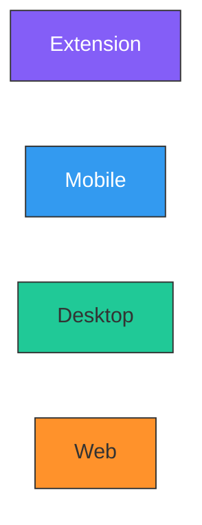

# Diagram Generation Reference

## Using the Diagram Tool

Use `mcp__figma-remote-mcp__generate_diagram` to create Mermaid diagrams in FigJam.

### Supported Diagram Types

1. **Flowchart / Graph** (`graph` or `flowchart`)
2. **Sequence Diagram** (`sequenceDiagram`)
3. **State Diagram** (`stateDiagram-v2`)
4. **Gantt Chart** (`gantt`)

## Flowchart Patterns for PR Review

### File Dependency Graph Template



### Package Layer Diagram Template



### Data Flow Template



## Sequence Diagram Patterns

### API Request Flow Template



### Hardware Wallet Interaction Template



## State Diagram Patterns

### Loading State Template



### Transaction State Template



## Styling Guidelines

### Risk Level Colors



### Platform Colors



## Best Practices

### Do

- Keep node labels short (use abbreviations)
- Use subgraphs to group related items
- Add edge labels for clarity
- Use consistent direction (LR for flows, TD for hierarchies)
- Highlight the changed/new parts

### Don't

- Create diagrams with more than 20 nodes
- Use complex styling that distracts
- Include implementation details in labels
- Mix different abstraction levels

### When to Use Each Type

| Diagram Type | Use When |
|-------------|----------|
| `graph LR` | File dependencies, data flow |
| `graph TD` | Component hierarchy, package structure |
| `sequenceDiagram` | API calls, async operations, user flows |
| `stateDiagram-v2` | State machines, loading states |
| `gantt` | Task planning (rarely used in PR review) |

## Example Tool Call

```typescript
// Generate a file dependency diagram
mcp__figma-remote-mcp__generate_diagram({
  name: "PR #123 File Dependencies",
  userIntent: "Show how changed files relate to each other",
  mermaidSyntax: `graph LR
    subgraph "Changed"
        A["useWallet.ts"]
        B["WalletService.ts"]
    end
    subgraph "Affected"
        C["HomePage.tsx"]
        D["SettingsPage.tsx"]
    end
    A --> B
    C --> A
    D --> A`
})
```
